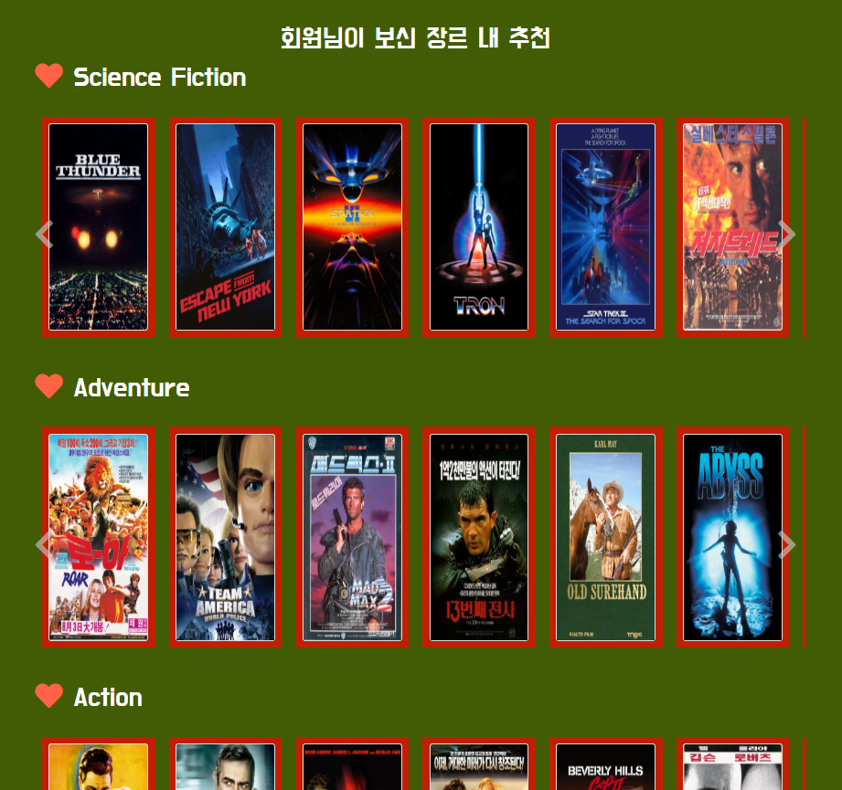
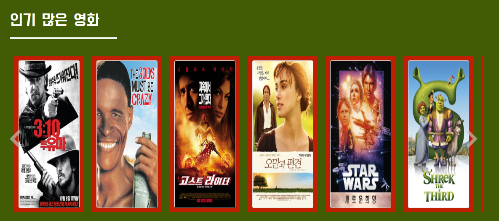
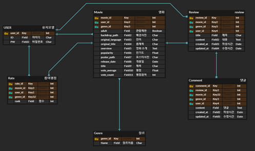

# SSAFY 최종 프로젝트

## 목표

* 영화 정보 기반 추천 서비스 구성
* 커뮤니티 서비스 구성
* HTML, CSS, JavaScripts, Django 활용
* 서비스 배포 및 관리


## 개발환경

1. Python Web Framework

   A. Django 2.1.15

   B. Python 3.7+


2. 개발 아키텍쳐
   * Django & Vanila JS


3. 서비스 배포 환경
   * 서버 : Amazon Linux
   * DB : 

---


## Trello를 이용한 일정관리

> Url : `https://trello.com/b/VvNEXFFk/ssafy-최종-프로젝트`


## VS Code Live Share

> Live Share를 통한 협업 


## git을 이용한 공동 작업공간

> git branch 사용
>
> 한광욱 : brchA
> 이예림 : brchB


### branch 명령어

```bash
#브랜치 생성
$git branch { 브랜치명 }

#브랜치 이동
$git checkout {브랜치명}

#브랜치 확인
$git branch

[참고사이트]
https://victorydntmd.tistory.com/91
```


### git 하루 루틴

> ##### 아침
>
> 각자 브랜치에서 전 날 올린 master file pull하기

```bash
$git checkout brchB
$git pull origin master
```

> ##### 틈틈이
>
> 각자 브랜치에서 작업 후 

```bash
$git add.
$git commit -m '메세지'
$git push origin brchB
```

> ##### 자기 전
>
> master로 이동 후 각자 브랜치에서 작업한 것 pull, push하기

```bash
$git checkout master
$git pull origin brchB
$git push origin master

#pull했을 때 충돌오류 발생 => 충돌 해결 후 push
```


## 파일 구조

```

```


## 명세서

### 1단계 : 필수구현

* JSON파일 받아오기
* The Movie Data Base 의 api 사용
* index.html
  * JSON image받아오기


## 가상환경 생성

```
1. .gitignore 파일생성 // project 바깥쪽에

2. gitignore.io 사이트

   > venv, django, python

3. python -m venv venv

4. source venv/Scripts/activate

5. pip list로 확인

6. pip freeze => 필요한 다운로드 파일 확인

7. pip freeze > requirements.txt  //다운 받을 파일들 requirements.txt에 저장

8. pip install -r requirements.txt // requirements.txt에 저장된 파일들 다운받기

9. deactivate //가상환경 종료 
```


## API를 통해 받은 데이터 파일 생성

1. The Movie Data Base 에 가입하여 API_KEY 생성
2. 원하는 데이터를 담은 JSON 파일을 생성할 Python Code 작성
3. 파이썬 코드 실행하면 JSON파일 생성됨

```python
# 영화 장르 추출
import requests

import json
# import pandas as pd
# from io import StringIO


# API 지정

apikey = "91f3048e6d4f7b2729a87dcfbbef1b04"


# 정보를 알고 싶은 영화 리스트 만들기

movie_list = range(1, 1000)


# API 지정

api = "https://api.themoviedb.org/3/movie/{movies}?api_key={key}"


# string.format_map() 매핑용 클래스 만들기

class Default(dict):

    def __missing__(self, key):

        return key


# 각 영화의 정보 추출하기
data = {}
genres = []
x = 0
vis = [0]*99999999
for name in movie_list:
    # API의 URL 구성하기

    url = api.format_map(Default(movies=name, key=apikey))

        # print(url)  # 데이터 확인

    # API에 요청을 보내 데이터 추출하기

    r = requests.get(url)  # json 형태의 데이터가 나온다.

        # print(type(r))  # <class 'requests.models.Response'>

    # 결과를 JSON 형식으로 변환하기
    a = json.loads(r.text)
    if 'status_code' in a:
        continue
    else:
        b = a['genres']
        z = {}
        y = {}
        x = {}

        for i in range(len(b)):
            if vis[b[i]['id']] == 0:
                vis[b[i]['id']] = 1
                z["fields"] = {"name" : b[i]['name']}
                y["pk"] = (b[i]['id'])
                x["model"] = "movies.Genre"
                mid = dict(y, **z)
                total = dict(x, **mid)
                genres.append(total)    

            
            # print(x)
            # print(y)
            # data[x] = y
       
    # print('')
# print('')
# print(genres)
 
        
with open('TMDVGenredata.json', 'w', encoding="utf-8") as f:
    json.dump(genres, f, ensure_ascii=False, indent="\t")
```


```python
# 영화 데이터 JSON 만들기
import requests

import json
# import pandas as pd
# from io import StringIO


# API 지정

apikey = "91f3048e6d4f7b2729a87dcfbbef1b04"


# 정보를 알고 싶은 영화 리스트 만들기

movie_list = range(1, 10000)


# API 지정

api = "https://api.themoviedb.org/3/movie/{movies}?api_key={key}"


# string.format_map() 매핑용 클래스 만들기

class Default(dict):

    def __missing__(self, key):

        return key


# 각 영화의 정보 추출하기
data = []
x = 0
for name in movie_list:
    # API의 URL 구성하기

    url = api.format_map(Default(movies=name, key=apikey))

        # print(url)  # 데이터 확인

    # API에 요청을 보내 데이터 추출하기

    r = requests.get(url)  # json 형태의 데이터가 나온다.

        # print(type(r))  # <class 'requests.models.Response'>

    # 결과를 JSON 형식으로 변환하기
    a = json.loads(r.text)
    # print(type(a))
    # print(a)
    
    b = {}
    try:
        if 'status_code' in a:
            continue
        else :
            a['genres'] = [a['genres'][0]["id"]] 
            del a['belongs_to_collection']
            del a['budget']
            del a['imdb_id']
            del a['homepage']
            del a['id']
            del a['production_companies']
            del a['production_countries']
            del a['revenue']
            del a['runtime']
            del a['spoken_languages']
            del a['tagline']
            del a['video']
            del a['status']
            b['fields'] = a
            jd= {"model" : "movies.Movie", "pk": x }
            c = dict(jd, **b)
            data.append(c)
            x += 1
    except:
        continue

        

with open('TMDBdata.json', 'w', encoding="utf-8") as f:
    json.dump(data, f, ensure_ascii=False, indent="\t")
```


## 데이터 파일 DB에 load하기

```
#model.py에 data 모델 정의하기
$python manage.py loaddata {파일명.json}
 *주의 : json파일 1.models.py class내 fields 입력순서 맞추기, 
 			     2.model, pk, fields설정 필수
                     {
                        model: 'app명.class명',
                        pk: <int형>,
                        fields: {
                            ...
                        }

                     }

#데이터 보는법

1. pip install django-extensions //설치
2. settings.py에 INSTALLED_APPS에 'django_extensions'정의
3. shell로 들어가서 확인 

$python manage.py shell
>>>from app이름.models import 모델명
>>>모델명.objects.all()
```

#### VS Code sqlite DB표 확인

`ctrl + shift + p`  > `>sqlite : open`

### 팀원 정보 및 업무 분담 내역

---

#### 한광욱

- 데이터 추출
- 알고리즘 구현
- GIT 관리
- 일정계확 및 관리

#### 이예림

- 모델 설계
- Bootstrap 디자인
- UCC제작
- README 관리


### 목표 서비스 구현 및 실제 구현 정도

---

목표 서비스 

- 사용자가 입력한 평점을 기반으로 평점을 남긴 영화의 장르와 같은 장르 3개의 영화를 추천해준다
- 공통적으로 평점 8점 이상의 영화를 추천한다
- 공통적으로 인지도가 20 이상인 영화를 추천한다


실제 구현 정도

- 1, 2, 3번의 기준을 충족함






### 데이터베이스 모델링

---




### 필수 기능

---

필수기능 목록인 관리자권한, 추천 알고리즘, 커뮤니티 (로그인 유저만 가능한 것, 리뷰, 댓글) URL 5개 이상 등에 대해 모두 만족하였고 영상으로 제작하였다.


##  important Code

#### detail.html

**이거로 4시간 헤맴**

>  comment 작성과 비슷하게 Rate는 User와 Movie가 Foreignkey로 연결되어있다
>
> Rate와 User는 1:N, Movie와 User도 1:N의 관계를 갖는다
>
> 1의 클래스에서 N의 클래스 정보를 가져오고 싶으면 `1의 class.N의class_set` 형식으로 사용해준다
>
> 그래서 1:N인 movie와 rate의 관계에서 rate의 정보를 가져오고 싶으면 `movie.rate_set`을 이용하면 된다


```
#movies > models.py

class Movie(models.Model):
    ...
	
    vote_user = models.ManyToManyField(settings.AUTH_USER_MODEL, related_name="vote_movie", blank=True)

class Comment(models.Model):
    ...
    user = models.ForeignKey(settings.AUTH_USER_MODEL, on_delete=models.CASCADE)
    review = models.ForeignKey(Review, on_delete=models.CASCADE)


class Rate(models.Model):
    rank = models.IntegerField()
    user = models.ForeignKey(settings.AUTH_USER_MODEL, on_delete=models.CASCADE)
    movie = models.ForeignKey(Movie, on_delete=models.CASCADE)
```

```
#movies > detail.html



{{ rank.user}} : {{ rank.rank }}


```


### views.py - def index

알고리즘을 구성하는 가장 핵심 코드로, 쿼리셋을 사용하는 방법과, 역참조 개념에  대한 이해도가 부족하여 가장 많은 시간을 소모했다.

평점을 남긴 영화의 장르를 뽑아오기 위한 관계설정 등이 쉽지 않았지만, 결국 찾아내었고, 리스트에 담아 호출했다


```python
def index(request):
    movies = Movie.objects.all()
    fr_movies = Movie.objects.all().exclude(poster_path__isnull=True).exclude(backdrop_path__isnull=True).filter(popularity__gte=20).order_by('?')[:21]
    en_movies = Movie.objects.all().exclude(poster_path__isnull=True).exclude(backdrop_path__isnull=True).filter(vote_average__gte=8).order_by('?')[:21]
    lists = {fr_movies:'인기 많은 영화',  en_movies:'평점 높은 영화'}
    ### 유저가 투표한 장르의 영화들을 가져옴###
    user_movie = Movie.objects.all().filter(vote_user=request.user.id)
    # 영화들이 쿼리셋형태라 mv로 각각의 요소를 가져올 것임
    gen_list = {} # 나의 장르 리스트 // 평점을 표현한 영화의 장르들의 목록. 어떤 장르를 몇개 투표했는지 알기 위해
    for mv in user_movie:
        ge = mv.id # 해당 영화의 id를 ge라고 선언
        gen = Genre.objects.all().filter(movie_genre=ge) # 역참조로 해당 영화에 대한 장르정보를 장르 테이블에서 가져옴 (이름 알기 위해)
        for genr in gen: # 장르 요소가 쿼리셋이어서 genr로 선언
            genre = genr.id # 해당 장르의 id를 가져옴
            if genre in gen_list: # 평점을 남긴 영화의 장르가 나의 장르 리스트에 있는지 보고
                gen_list[genre] += 1 # 있으면 1 증가
            else:
                gen_list[genre] = 1 # 없으면 만들어 줌
           
    sorted(gen_list.items(), key=lambda x: x[1], reverse=True) # 갯수 상위 순으로 출력 위해서 정렬
    
    x = 0
    recommend_list = {}
    for key, value in gen_list.items(): # 딕셔너리 형태여서 
        if x == 3: # 상위 3개만 출력하기 위해
            break
        gen_rec_m = Movie.objects.all().exclude(poster_path__isnull=True, backdrop_path__isnull=True).filter(genres = key).order_by('?')[:21] # 장르기반 추천 영화 목록// 장르기준으로 랜덤 4개 출력
        keyname = Genre.objects.all().filter(id=key) # 장르 이름을 출력해야해서, 장르id를 key로 하고
        recommend_list[keyname] = gen_rec_m # 선별한 쿼리셋을 value로 한 딕셔너리 만듬
        x += 1
# 이후 context러 남겨 즘
```


### Multi Card Carousel

여러개 카드를 일렬로 나열하여 돌아가게 하는 것이 어려웠음

구글링을 통해 소스코드를 찾아 변형하여 사용

#### index.html 부분에 담겨있으며 JS와 CSS 부분이 필요

``` html
<div class="container">
            
                
                <h1 class="f doh-font"><i class="fas fa-heart mr-3" style='color:tomato'></i>{{ k.name }}</h1>
                
                <div class="row pb-4">
                    <div class="MultiCarousel" data-items="1,3,5,6" data-slide="3" id="MultiCarousel"  data-interval="1000">
                        <div class="MultiCarousel-inner">
                            
                            
                            <div class="item">
                                <div class="pad15">
                                    <div class="card">
                                        <a href=""></a>
                                    </div>
                                </div>
                            </div>
                            
                            
                        </div>
                        <button class="btn leftLst"><i class="fas fa-chevron-left fa-3x" style='color: rgba(202, 202, 202, 0.616);'></i></button>
                        <button class="btn rightLst"><i class="fas fa-chevron-right fa-3x" style='color: rgba(202, 202, 202, 0.616);'></i></button>
                    </div>
                </div>        
            
        
        </div>
```

### def detail에서

남긴 평점을 표현하는 것이 쉽지 않았다

``` python
  point = 0
    for score in rate:
        if request.user.id == score.user_id and movie_pk == score.movie_id:
            point = int(score.rank)
```

다음과 같은 코드로 point를 값을 증가시켰고 point를 넘겨주어서 표현하였다


### 배포 서버 URL

---


### 기타 느낀점

---

무언가를 자력으로 처음부터 끝까지 한다는 것이 쉽지 않았다. 특히 창작의 영역이라 할 수 있는 사이트 꾸미기 등은 사소한 것에도 의견이 나뉘어 이를 합의하는 과정이 쉽지 많은 않았지만, 서로 배려하고 능력을 발휘해서 마무리 할 수 있었다. 당일에 수행하는 관통 PJT 보다 더 오랜시간동안 협업을 하고 한 것이 실제 개발자의 업무를 순한맛 정도로 맛본거 같아 유익한 경험이 되었다.

